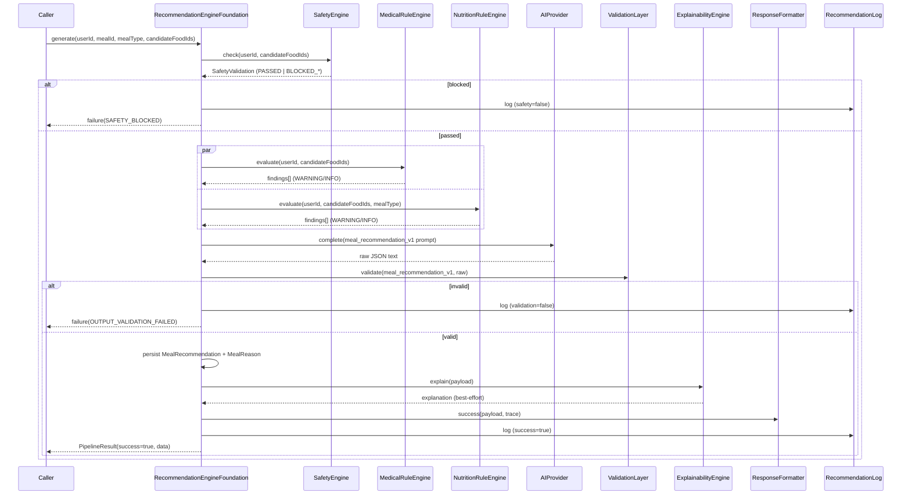
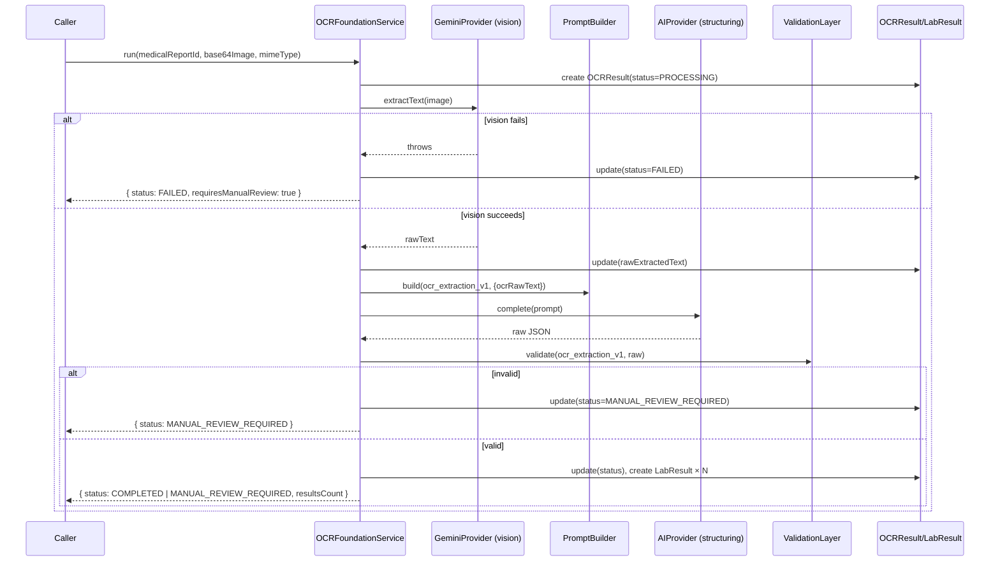
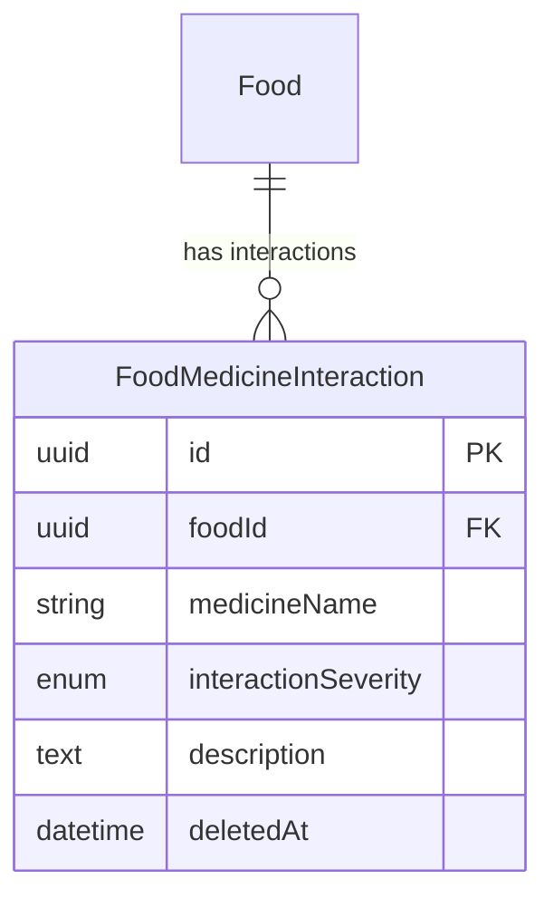

# AI Foundation — Architecture Diagrams

## 1. Module dependency graph

```mermaid
graph TD
    ENV[AI_ENV config] --> PF[AIProviderFactory]
    OAI[OpenAICompatibleProvider] --> PF
    GEM[GeminiProvider] --> PF

    PF --> PB[PromptBuilderService]
    PTS[PromptTemplateService] --> PB
    DB[(PostgreSQL / Prisma)] --> PTS
    BUNDLED[bundled template content] -.fallback.-> PTS

    PB --> EXP[ExplainabilityEngineService]
    PF --> EXP
    VL[ValidationLayerService] --> EXP
    DB --> EXP

    ALLERGY[AllergyRule] --> SAFETY[SafetyEngineService]
    MEDCOND[MedicalConditionRule] --> SAFETY
    MEDINT[MedicineInteractionRule] --> SAFETY
    DB --> ALLERGY & MEDCOND & MEDINT

    DIAB[DiabetesRule] --> MRE[MedicalRuleEngineService]
    HTN[HypertensionRule] --> MRE
    RENAL[RenalRule] --> MRE
    HEP[HepaticRule] --> MRE
    PREG[PregnancyRule] --> MRE
    DB --> DIAB & HTN & RENAL & HEP & PREG

    DB --> NRE[NutritionRuleEngineService]

    SAFETY --> RE[RecommendationEngineFoundationService]
    MRE --> RE
    NRE --> RE
    VL --> RE
    FMT[ResponseFormatterService] --> RE
    PB --> RE
    PF --> RE
    EXP --> RE
    DB --> RE

    GEM -->|vision| OCR[OCRFoundationService]
    PB --> OCR
    PF --> OCR
    VL --> OCR
    DB --> OCR

    VS[VectorSearchService] --> KB[KnowledgeBaseService]
    EP[EmbeddingPipelineService] --> KB
    DB --> KB
    PF --> VS & EP
    PVS[PRIMARY_VECTOR_STORE] --> VS & EP
    FVS[FALLBACK_VECTOR_STORE] --> VS
```

## 2. The mandatory recommendation pipeline (sequence)

## 3. OCR pipeline (sequence)

## 4. Entity-relationship additions this phase

Only one table was added (additive-only, per the completion gate). See
`docs/SCHEMA_CHANGELOG.md` for the full write-up.

